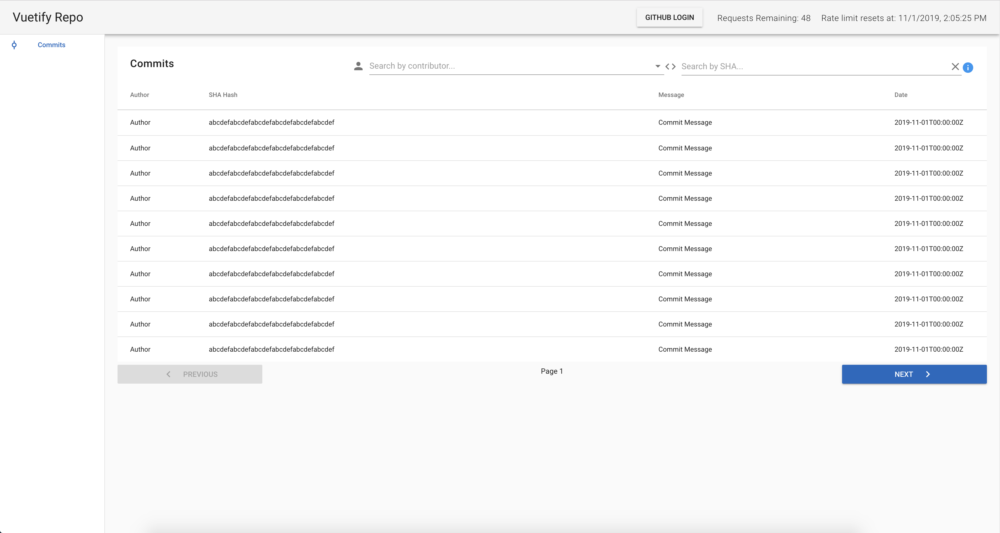
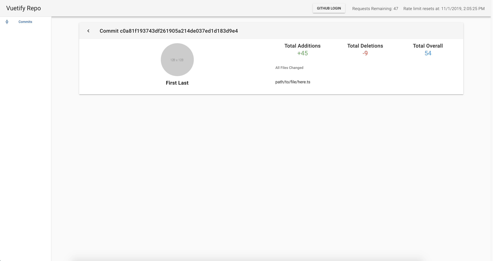

# sample-alpha-project

## Docker Setup
#### Build the image
```
npm run docker:build
```

#### Run it
```bash
npm run docker:run
```
##### App is running on http://localhost:8080

### Requirements
- [ ] Must poll data on a set interval from an API Data Source either a static file or an API Data source of your choosing
- [ ] Must be able to auth with github to increase rate limit
- [ ] Must render the data in a list view with pagination
- [ ] Must have sorting and filtering on at least 2 fields
- [ ] Must persist sort/filter preferences on page refresh
- [ ] Must have the ability to click on an object in the list view to display extended details of the object on a separate page

### Designs




## Project setup
```
yarn install
```

#### Cypress
```bash
npm run test:e2e
```


### Compiles and hot-reloads for development
```
yarn run serve
```

### Compiles and minifies for production
```
yarn run build
```

```bash
# run coverage report
yarn run test:cov
```

### Lints and fixes files
```
yarn run lint
```

### Run your unit tests
```
yarn run unit
```

### Customize configuration
See [Configuration Reference](https://cli.vuejs.org/config/).
